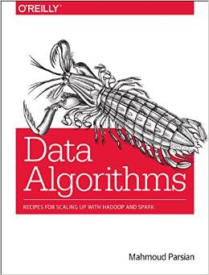
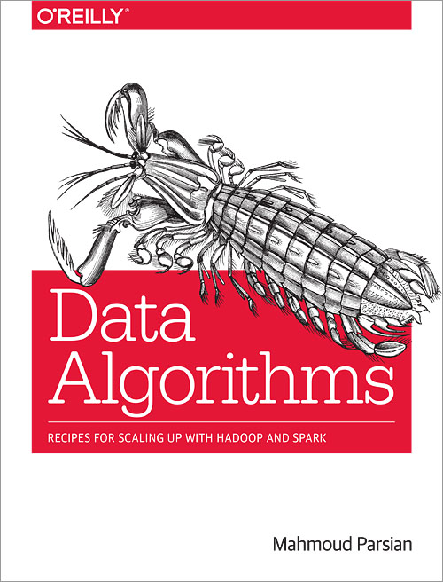

[Data Algorithms Book](http://shop.oreilly.com/product/0636920033950.do)
======================
* Author: Mahmoud Parsian (mahmoud.parsian@yahoo.com)
* Title: [Data Algorithms: Recipes for Scaling up with Hadoop and Spark](http://shop.oreilly.com/product/0636920033950.do) 
* This GitHub repository will host all source code and scripts for [Data Algorithms Book](http://shop.oreilly.com/product/0636920033950.do).
* Publisher: [O'Reilly Media](http://shop.oreilly.com/product/0636920033950.do)
* Published date: July 2015

[Production Version is Available NOW!](http://shop.oreilly.com/product/0636920033950.do)
======================================

[Upgraded to Spark-2.0.0](http://spark.apache.org/news/spark-2-0-0-released.html)
=========================

[](http://shop.oreilly.com/product/0636920033950.do)

[Added Java 8's LAMBDA Expressions to Spark...](./misc/jdk8_and_lambda.md)
================================================

[Scala Spark Solutions](./src/main/scala/org/dataalgorithms)
============================================================

[How To Build using Apache's Ant](./misc/ant/README.md)
===============================

[How To Build using Apache's Maven](./misc/maven/README.md)
===================================

[Machine Learning Algorithms using Spark](./src/main/java/org/dataalgorithms/machinelearning)
=========================================

[Spark for Cancer Outlier Profile Analysis](http://hadoopsummit.uservoice.com/forums/344955-data-science-analytics-and-spark/suggestions/11664381-spark-solution-for-cancer-outlier-profile-analysis)
====================================================
 
[Webinars and Presentions on Data Algorithms](./misc/webinars.md)
=================================================================

[Introduction to MapReduce](https://github.com/mahmoudparsian/data-algorithms-book/tree/master/src/main/java/org/dataalgorithms/bonus/charcount)
===========================
 
[Bonus Chapters](./misc/bonus-chapters.md)
================
 
[Author Book Signing](./misc/book-signing.md)
=====================


<!---
your comment goes here
and here

Work in Progress...
===================
Please note that this is a work in progress...

--> 


[How To Run Spark/Hadoop Programs](./misc/run_spark/README.md)
==================================


[Submit a Spark Job from Java Code](./misc/how-to-submit-spark-job-from-java-code.md)
===========================================


How To Run Python Programs
==========================
To run python programs just call them with `spark-submit` together with the arguments to the program.

[My favorite quotes...](./misc/favorite_quotes/README.md)
=========================================================

 
Questions/Comments
==================
* [View Mahmoud Parsian's profile on LinkedIn](http://www.linkedin.com/in/mahmoudparsian)
* Please send me an email: <mahmoud.parsian@yahoo.com>
* [Twitter: @mahmoudparsian](http://twitter.com/mahmoudparsian) 

Thank you!
````
best regards,
Mahmoud Parsian
````

[](http://shop.oreilly.com/product/0636920033950.do)
