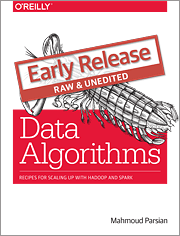

[Data Algorithms Book](http://shop.oreilly.com/product/0636920033950.do)
======================
Data Algorithms: Recipes for Scaling up with Hadoop and Spark

[](http://shop.oreilly.com/product/0636920033950.do)  [](http://shop.oreilly.com/product/0636920033950.do) 
 
[Autor Book Signing](http://strataconf.com/big-data-conference-ca-2015/public/content/author-signings)
====================
Author book signings for ("Data Algorithms") will be held in the O'Reilly booth on Thursday, Feb. 19, 2015.
Complimentary copies of books will be provided for the first 25 attendees. 

[Bonus Chapters](https://github.com/mahmoudparsian/data-algorithms-book/tree/master/src/main/java/org/dataalgorithms/bonus)
================
I have started adding bonus chapters.

Repository
==========
This repository will host all source code and scripts for
[Data Algorithms Book](http://shop.oreilly.com/product/0636920033950.do).
This book provides a set of distributed MapReduce algrithms, which are implemented using
* Java (JDK7)
* Spark 1.3.0
* MapReduce/Hadoop 2.6.0

Work in Progress...
===================
Please note that this is a work in progress...


URL To Data Algorithms Book
===========================
* Title: [Data Algorithms](http://shop.oreilly.com/product/0636920033950.do)
* Author: Mahmoud Parsian
* Publisher: O'Reilly Media


Source Code
===========
* All [source code](./src), libraries, and build scripts are posted here
* [Shell scripts](./scripts) are posted for running Spark and Mapreduce/Hadoop programs (in progress...)


Software Used
=============

Software | Version
---------|--------
Java     | JDK7
Hadoop   | 2.6.0
Spark    | 1.3.0
Ant      | 1.9.4


Structure of Repository
=======================

Name          | Description
--------------|------------
README.md     | The file you are reading now
README_lib.md | Must read before you build with Ant
src           | Source files for MapReduce/Hadoop/Spark
scripts       | Shell scripts to run MapReduce/Hadoop and Spark pograms
lib           | Required jar files for compiling source code
build.xml     | The ant build script
dist          | The ant build's output directory (creates a single JAR file)
LICENSE       | License for using this repository (Apache License, Version 2.0)
misc          | misc. files for this repository
setenv        | example of how to set your environment variables before building
data          | sample data files (such as FASTQ and FASTA) for basic testing purposes

Structure of src Directory
==========================


Also, each chapter has two sub folders:
```
org.dataalgorithms.chapNN.spark      (for Spark programs)
org.dataalgorithms.chapNN.mapreduce  (for Mapreduce/Hadoop programs)

where NN = 00, 01, ..., 31
```

How To Build using Apache's Ant
===============================
[How To Build by Ant](./misc/how_to_build_with_ant.md)


Sample Builds by Ant
====================
* [Sample Build by Ant for MacBook](./misc/sample_build_mac.txt)
* [Sample Build by Ant for Linux](./misc/sample_build_linux.txt)


How To Run Spark/Hadoop Programs
================================
* [How To Run MapReduce/Hadoop Programs](./misc/how_to_run_hadoop_programs.sh)
* [How To Run Java/Spark Programs in YARN](./misc/how_to_run_spark_in_yarn.sh)
* [How To Run Java/Spark Programs in Spark Cluster](./misc/how_to_run_spark_in_spark_cluster.sh)

How To Run Python Programs
==========================
To run python programs just call them with `spark-submit` together with the arguments to the program.

 
Questions/Comments
==================
* [View Mahmoud Parsian's profile on LinkedIn](http://www.linkedin.com/in/mahmoudparsian)
* Please send me an email: mahmoud.parsian@yahoo.com
* [Twitter: @mahmoudparsian](http://twitter.com/mahmoudparsian) 

Thank you!
````
best regards,
Mahmoud Parsian
````

[](http://shop.oreilly.com/product/0636920033950.do)
