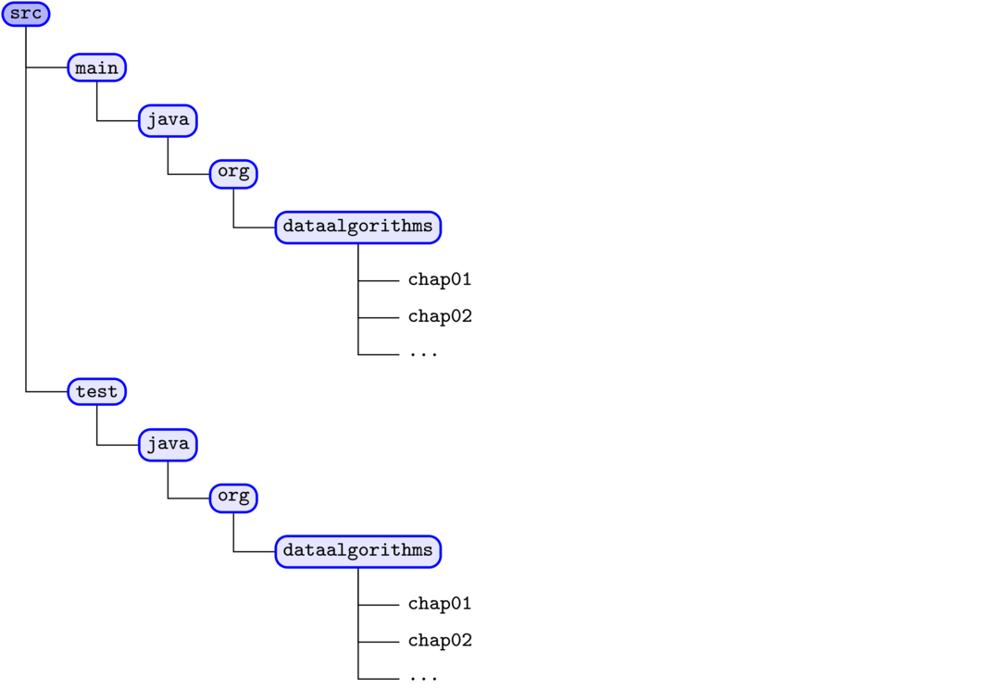

Repository
==========
This repository will host all source code and scripts for
[Data Algorithms Book](http://shop.oreilly.com/product/0636920033950.do).
This book provides a set of distributed MapReduce algrithms, which are implemented using
* Java (JDK7)
* Spark 1.5.2
* MapReduce/Hadoop 2.6.0

Source Code
===========
* All [source code](../src), libraries, and build scripts are posted here
* [Shell scripts](../scripts) are posted for running Spark and Mapreduce/Hadoop programs (in progress...)


Software Used
=============

Software | Version
---------|--------
Java     | JDK7
Hadoop   | 2.6.0
Spark    | 1.5.2
Ant      | 1.9.4


Structure of Repository
=======================

Name          | Description
--------------|--------------------------------------------------------------------
README.md     | The file you are reading now
src           | Source files for MapReduce/Hadoop/Spark
scripts       | Shell scripts to run MapReduce/Hadoop and Spark pograms
lib           | Required jar files for compiling source code
build.xml     | The ant build script
dist          | The ant build's output directory (creates a single JAR file)
LICENSE       | License for using this repository (Apache License, Version 2.0)
misc          | misc. files for this repository
setenv        | example of how to set your environment variables before building
data          | sample data files (such as FASTQ and FASTA) for basic testing purposes

Source Code Directory Structure
===============================


* Book chapters: each book chapter has two sub folders:
````
org.dataalgorithms.chapNN.spark      (for Spark programs)
org.dataalgorithms.chapNN.mapreduce  (for Mapreduce/Hadoop programs)

where NN = 00, 01, ..., 31
````
* Bonus Chapters: each bonus chapter has the following package structure:
````
org.dataalgorithms.bonus.<chapter-name>.spark      (for Spark programs)
org.dataalgorithms.bonus.<chapter-name>.mapreduce  (for Mapreduce/Hadoop programs)
````

Machine Learning Algorithms
===========================
````
org.dataalgorithms.machinelearning.<package-name> 
````