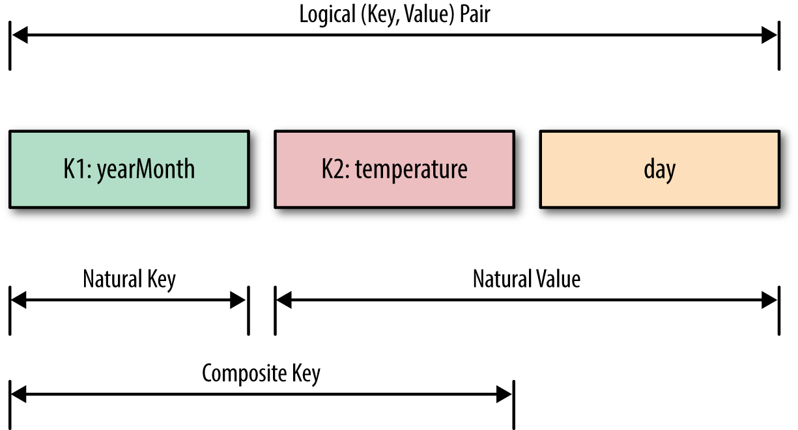

Chapter 01: Secondary Sorting
==========
The purpose of this chapter is to have a sorted values 
for reducer keys.  For example, if our input is like 
time series (sample is given below), the the values for 
each key is sorted. 


Each input record has the following format:

````
<key><,><time><,><value>
````

Sample Input
============
````
$ cat time_series.txt 
p,4,40
p,6,20
x,2,9
y,2,5
x,1,3
y,1,7
y,3,1
x,3,6
z,1,4
z,2,8
z,3,7
z,4,0
p,1,10
p,3,60
````

Expected Output
===============
````
(z,{1=4, 2=8, 3=7, 4=0})
(p,{1=10, 3=60, 4=40, 6=20})
(x,{1=3, 2=9, 3=6})
(y,{1=7, 2=5, 3=1})
````

Note that values are sorted by ````<time>```` portion of the values.

Packages
========

Package Name                              | Description |
----------------------------------------- | ----------------------------------------------------------------- | 
org.dataalgorithms.chap01.spark           | Spark solution using groupByKey() and combineByKey()              | 
org.dataalgorithms.chap01.sparkwithlambda | Spark solution with Lambda using groupByKey() and combineByKey()  | 
org.dataalgorithms.chap01.mapreduce       | MapReduce/Hadoop solution using Secondary Sort                    | 
org.dataalgorithms.chap01.util            | Some utility classes...                                           | 

Sample Script
=============
````
$ cat run_secondary_sorting_using_combineByKey.sh 
#!/bin/bash
export JAVA_HOME=/Library/Java/JavaVirtualMachines/jdk1.8.0_72.jdk/Contents/Home/
echo "JAVA_HOME=$JAVA_HOME"
#
export BOOK_HOME=/Users/mparsian/zmp/github/data-algorithms-book
export SPARK_HOME=/Users/mparsian/spark-1.6.1-bin-hadoop2.6
export SPARK_MASTER=spark://localhost:7077
export SPARK_JAR=$BOOK_HOME/lib/spark-assembly-1.6.0-hadoop2.6.0.jar
export APP_JAR=$BOOK_HOME/dist/data_algorithms_book.jar
# define input parameters
INPUT="file://$BOOK_HOME/time_series.txt"
OUTPUT="file://$BOOK_HOME/output"
#
prog=org.dataalgorithms.chap01.spark.SparkSecondarySortUsingCombineByKey
$SPARK_HOME/bin/spark-submit  --class $prog --master $SPARK_MASTER $APP_JAR $INPUT $OUTPUT
````

Sample Script Run
=================
````
$ ./run_secondary_sorting_using_combineByKey.sh
JAVA_HOME=/Library/Java/JavaVirtualMachines/jdk1.8.0_72.jdk/Contents/Home/
inputPath=file:///Users/mparsian/zmp/github/data-algorithms-book/time_series.txt
outputPath=file:///Users/mparsian/zmp/github/data-algorithms-book/output
===  DEBUG STEP-4 ===
p,4,4
p,6,6
x,2,2
y,2,2
x,1,1
y,1,1
y,3,3
x,3,3
z,1,1
z,2,2
z,3,3
z,4,4
p,1,1
p,3,3
===  DEBUG STEP-6 ===
z
{1=4, 2=8, 3=7, 4=0}
p
{1=10, 3=60, 4=40, 6=20}
x
{1=3, 2=9, 3=6}
y
{1=7, 2=5, 3=1}
````
