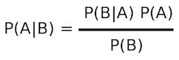

Naive Bayes Classifier
======================
In machine learning, naive Bayes classifiers are a 
family of simple probabilistic classifiers based on 
applying Bayes' theorem with strong (naive) independence 
assumptions between the features.

Packages
========
* org.dataalgorithms.chap14.spark
* org.dataalgorithms.chap14.sparkwithlambda
* org.dataalgorithms.chap14.mapreduce

References
==========
* [Naive Bayes classifier](https://en.wikipedia.org/wiki/Naive_Bayes_classifier)
* [Naive Bayesian](http://www.saedsayad.com/naive_bayesian.htm)
* [Classification](https://inst.eecs.berkeley.edu/~cs188/fa09/projects/classification/classification.html)