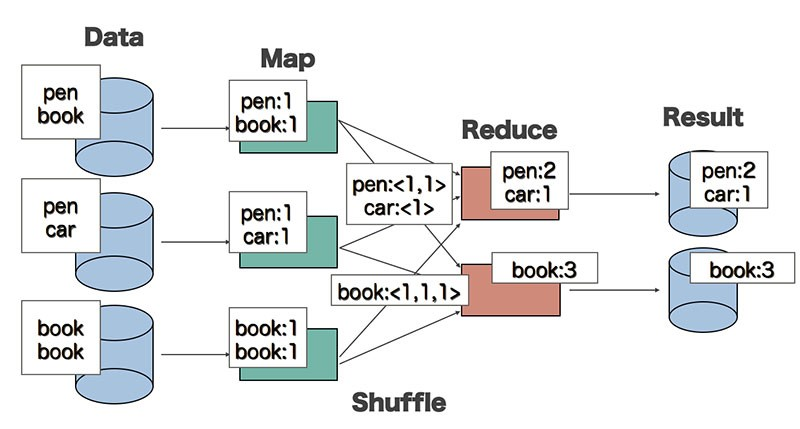

Bonus Chapter: Classic Word Count
=================================
The purpose of this chapter is to demo "classic word count" 
in MapReduce/Hadoop and Spark. You may update these MR programs
and run them by your own input.

 

Packages 
=======

Package                                                 | Description                                      |
------------------------------------------------------- | ------------------------------------------ | 
org.dataalgorithms.chapB01.wordcount.spark              | basic word count in Spark -- without Lambda Expr.                        | 
org.dataalgorithms.chapB01.wordcount.sparkwithlambda    | basic word count in Spark -- with Lambda Expr.                         | 
org.dataalgorithms.chapB01.wordcount.mapreduce          | basic word count in MapReduce/Hadoop                         |