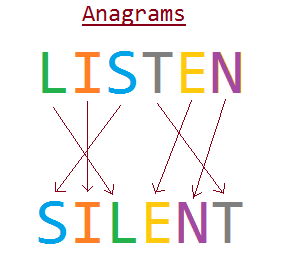

What is an Anagram?
===================
* Anagram is a word or phrase made by transposing the letters 
of another word or phrase.  

* An anagram is a type of word play, the result of rearranging 
the letters of a word or phrase to produce a new word or phrase, 
using all the original letters exactly once

* For example, the word "anagram" can be rearranged into "nagaram". 
"Elvis" can be rearranged into "lives", therefore "Elvis" and "lives"
are anagrams

* Someone who creates anagrams may be called an "anagrammatist"

* Here we work on anagrams, which are only single words. 


Examples
======== 
* The word "mary" can be rearranged into "army"
* The word "secure" is an anagram of "rescue"
* The word "elvis" can be rearranged into "lives"

Programs
========
The purpose of these MapReduce programs  (Hadoop and Spark) is to find anagrams 
for a set of given  documents.

We will ignore words if their length is less than N (we read N as a parameter).

Packages
--------

| Package Name                                               | Description                                    |
|------------------------------------------------------------|------------------------------------------------|
| ````org.dataalgorithms.chapB05.anagram.spark````           |  Spark Programs without Lambda Expressions     |
| ````org.dataalgorithms.chapB05.anagram.sparkwithlambda```` |  Spark Programs with Lambda Expressions        |
| ````org.dataalgorithms.chapB05.anagram.util````            |  Groups common methods                         |
| ````org.dataalgorithms.chapB05.anagram.mapreduce````       |  MapReduce/Hadoop Programs                                       |


Spark Programs without Lambda Expressions
-----------------------------------------
* These programs are in the ````org.dataalgorithms.chap05.anagram.spark```` package.
* These programs do not use lambda expressions.


| Spark Programs without Lambda Expressions    | Description                                                      |
|----------------------------------------------|------------------------------------------------------------------|
|  Program-1: ````AnagramFinder````            |  Basic Anagram Finder: using Spark's ````groupByKey()````        |
|  Program-2: ````AnagramUsingCombineByKey```` | Anagram Finder & Frequency: using Spark's ````combineByKey()```` |
|  Program-3: ````AnagramUsingGroupByKey````   | Anagram Finder & Frequency: using Spark's ````groupByKey()````   |


Spark Programs with Lambda Expressions
--------------------------------------
* These programs are in the ````org.dataalgorithms.chapB05.anagram.sparkwithlambda```` package.
* With the addition of lambda expressions in Java 8, I have updated Spark’s API to transparently 
support these expressions.

| Spark Programs with Lambda Expressions       | Description                                                      |
|----------------------------------------------|------------------------------------------------------------------|
|  Program-1: ````AnagramFinder````            |  Basic Anagram Finder: using Spark's ````groupByKey()````        |
|  Program-2: ````AnagramUsingCombineByKey```` | Anagram Finder & Frequency: using Spark's ````combineByKey()```` |
|  Program-3: ````AnagramUsingGroupByKey````   | Anagram Finder & Frequency: using Spark's ````groupByKey()````   |


MapReduce/Hadoop Program
------------------------
* These programs are in the ````org.dataalgorithms.chapB05.anagram.mapreduce```` package.

| MapReduce/Hadoop Program                     | Description                                                      |
|----------------------------------------------|------------------------------------------------------------------|
|  ````AnagramDriver````                       |  The driver program, which submits the job                       |
|  ````AnagramMapper````                       |  Implements the ````map()```` function                           |
|  ````AnagramReducer````                      |  Implements the ````reduce()```` function                        |


Common Spark Performance Pitfalls
=================================
Not all Spark's transformations and operations are equal, however, and 
a few of the most common performance pitfalls for novice Spark developers 
arise from picking the wrong one. for details see the following:

* [How-to: Tune Your Apache Spark Jobs (Part 1) by Sandy Ryza](http://blog.cloudera.com/blog/2015/03/how-to-tune-your-apache-spark-jobs-part-1/)
* [How-to: Tune Your Apache Spark Jobs (Part 2) by Sandy Ryza](http://blog.cloudera.com/blog/2015/03/how-to-tune-your-apache-spark-jobs-part-2/)

* Avoid using ````groupByKey()```` when performing an associative reductive 
operation (such as addition, multiplication, ...). In these situations, 
````reduceByKey()```` is a better option than ````groupByKey()````.

* Avoid ````reduceByKey()```` When the input and output value types are different.
You may use ````combineByKey()````. 

* Avoid the ````flatMap-join-groupBy```` pattern. When two datasets are already grouped 
by key and you want to join them and keep them grouped, you can just use cogroup. 
That avoids all the overhead associated with unpacking and repacking the groups.


Input Files for Testing
=======================
Data Set: http://www.gutenberg.org/dirs/etext02/mword10.zip

Sample Input
============
````
# cat sample_anagram.txt 
Mary and Elvis lives in Detroit army Easter Listen 
a silent eaters Death Hated elvis Mary easter Silent
Mary and Elvis are in a army Listen Silent detroit
````


Sample Script to run AnagramCountUsingCombineByKey
==================================================
Before running this script, you need to build the ````data_algorithms_book.jar```` file.

````
cat run_anagram_using_combineByKey.sh 
#!/bin/bash
export JAVA_HOME=/Library/Java/JavaVirtualMachines/jdk1.8.0_72.jdk/Contents/Home/
echo "JAVA_HOME=$JAVA_HOME"
#
export BOOK_HOME=/Users/mparsian/zmp/github/data-algorithms-book
export SPARK_HOME=/Users/mparsian/spark-1.6.1-bin-hadoop2.6
export SPARK_MASTER=spark://localhost:7077
export SPARK_JAR=$BOOK_HOME/lib/spark-assembly-1.6.0-hadoop2.6.0.jar
export APP_JAR=$BOOK_HOME/dist/data_algorithms_book.jar
#
# define input parameters
N=2
INPUT="file://$BOOK_HOME/sample_anagram.txt"
OUTPUT="file://$BOOK_HOME/output"
#
prog=org.dataalgorithms.chapB05.anagram.spark.AnagramCountUsingCombineByKey
$SPARK_HOME/bin/spark-submit  \
    --class $prog \
    --master $SPARK_MASTER \
    $APP_JAR $N $INPUT $OUTPUT
````

Sample Output for AnagramCountUsingCombineByKey
===============================================
Each output record has the following format:
````
<sorted-word><anagrams-and-associated-frequencies>
````


````
$ cat output/part-00000 
(adeht,{death=1, hated=1})
(eilnst,{silent=3, listen=2})
(eilsv,{lives=1, elvis=3})
(aeerst,{eaters=1, easter=2})
(amry,{army=2, mary=3})
````

Sample Script to run AnagramCountUsingGroupByKey
==================================================
Before running this script, you need to build the ````data_algorithms_book.jar```` file.

````
$ cat run_anagram_using_combineByKey.sh 
#!/bin/bash
export JAVA_HOME=/Library/Java/JavaVirtualMachines/jdk1.8.0_72.jdk/Contents/Home/
echo "JAVA_HOME=$JAVA_HOME"
#
export BOOK_HOME=/Users/mparsian/zmp/github/data-algorithms-book
export SPARK_HOME=/Users/mparsian/spark-1.6.1-bin-hadoop2.6
export SPARK_MASTER=spark://localhost:7077
export SPARK_JAR=$BOOK_HOME/lib/spark-assembly-1.6.0-hadoop2.6.0.jar
export APP_JAR=$BOOK_HOME/dist/data_algorithms_book.jar
# define input parameters
N=2
INPUT="file://$BOOK_HOME/sample_anagram.txt"
OUTPUT="file://$BOOK_HOME/output"
#
prog=org.dataalgorithms.chapB05.anagram.spark.AnagramCountUsingGroupByKey
$SPARK_HOME/bin/spark-submit  \
    --class $prog \
    --master $SPARK_MASTER \
    $APP_JAR $N $INPUT $OUTPUT
````

Sample Output for AnagramCountUsingGroupByKey
===============================================
Each output record has the following format:
````
<sorted-word><anagrams-and-associated-frequencies>
````

````
$ cat output/part-00000 
(adeht,{death=1, hated=1})
(eilnst,{silent=3, listen=2})
(eilsv,{lives=1, elvis=3})
(aeerst,{eaters=1, easter=2})
(amry,{army=2, mary=3})
````


Sample Script to run AnagramFinder
==================================================
Before running this script, you need to build the ````data_algorithms_book.jar```` file.

````
$ cat run_anagram_using_combineByKey.sh 
#!/bin/bash
export JAVA_HOME=/Library/Java/JavaVirtualMachines/jdk1.8.0_72.jdk/Contents/Home/
echo "JAVA_HOME=$JAVA_HOME"
#
export BOOK_HOME=/Users/mparsian/zmp/github/data-algorithms-book
export SPARK_HOME=/Users/mparsian/spark-1.6.1-bin-hadoop2.6
export SPARK_MASTER=spark://localhost:7077
export SPARK_JAR=$BOOK_HOME/lib/spark-assembly-1.6.0-hadoop2.6.0.jar
export APP_JAR=$BOOK_HOME/dist/data_algorithms_book.jar
# define input parameters
N=2
INPUT="file://$BOOK_HOME/sample_anagram.txt"
OUTPUT="file://$BOOK_HOME/output"
#
prog=org.dataalgorithms.chapB05.anagram.spark.AnagramFinder
$SPARK_HOME/bin/spark-submit  \
    --class $prog \
    --master $SPARK_MASTER \
    $APP_JAR $N $INPUT $OUTPUT
````

Sample Output for AnagramFinder
===============================================
Each output record has the following format:
````
<sorted-word><anagrams-and-associated-frequencies>
````

````
$ cat output/part-00000 
(adeht,[death, hated])
(eilnst,[silent, listen])
(eilsv,[lives, elvis])
(aeerst,[eaters, easter])
(amry,[army, mary])
````


References  
==========
* http://en.wikipedia.org/wiki/Anagram
* http://www.merriam-webster.com/dictionary/anagram


[](http://shop.oreilly.com/product/0636920033950.do) 

````
best regards
Mahmoud Parsian
````
