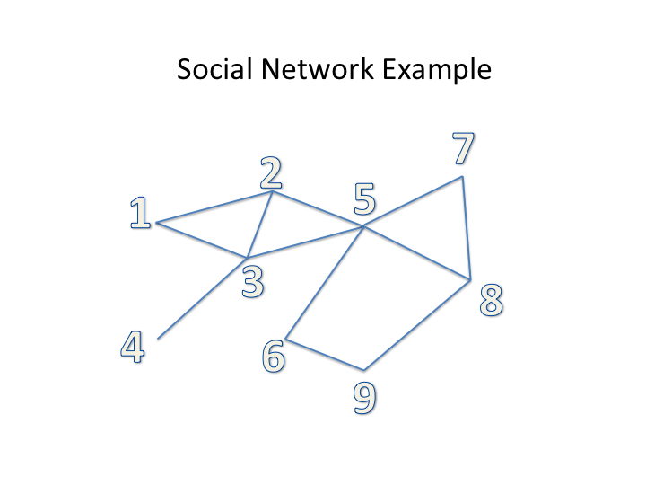

[]()

Count and List Triangles in a Graph
===================================

## References

* [Counting Triangles In Massive Graphs With Mapreduce, By Tamara G. Kolda, Ali Pinar, Todd Plantenga, C. Seshadhri, and Christine Task](https://arxiv.org/abs/1301.5887)

* [An Efficient MapReduce Algorithm for Counting Triangles in a Very Large Graph by Ha-Myung Park and Chin-Wan Chung](http://islab.kaist.ac.kr/chungcw/InterConfPapers/km0805-ha-myung.pdf)
 
## Sample Run

### Script
````
$ cat run_count_triangles_spark.sh
export JAVA_HOME=/Library/Java/JavaVirtualMachines/jdk1.7.0_60.jdk/Contents/Home
export BOOK_HOME=/Users/mparsian/zmp/github/data-algorithms-book
export SPARK_HOME=/Users/mparsian/spark-2.0.0-bin-hadoop2.6
export APP_JAR=$BOOK_HOME/dist/data_algorithms_book.jar
echo "APP_JAR=$APP_JAR"
#
export INPUT="file:///Users/mparsian/zmp/github/data-algorithms-book/graph.txt"
export OUTPUT="file:///Users/mparsian/zmp/github/data-algorithms-book/output"
#
driver="org.dataalgorithms.chap16.scala.CountTriangles"
$SPARK_HOME/bin/spark-submit --class $driver --verbose --master local $APP_JAR $INPUT $OUTPUT
````

### Input
````
$ cat graph.txt
1 2
1 3
2 3
2 5
3 4
3 5
5 6
5 7
5 8
7 8
8 9
6 9
````

### Output
````
$ cat output/part-00000
(2,3,5)
(1,2,3)
(5,7,8)
````

