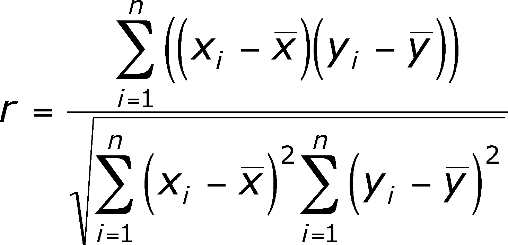

Correlation
===========
A correlation is a single number that describes the 
degree of relationship between two variables (samples 
of N-dimensions). Correlation is a measure of association 
of samples while "regression" is the fitting of a function 
to a set of observations.

In statistics, the Pearson product-moment correlation 
coefficient is a measure of the linear dependence between 
two variables X and Y, giving a value between -1.0 and +1.0 
inclusive, where +1.0 is total positive linear correlation, 
0.0 is no linear correlation, and −1.0 is total negative 
linear correlation. It is widely used in the sciences.

Possible correlations range from -1.0 to +1.0. 
* A zero correlation indicates that there is no relationship 
  between the variables. 
* A correlation of –1.0 indicates a perfect negative correlation, 
  meaning that as one variable goes up, the other goes down. 
* A correlation of +1.0 indicates a perfect positive correlation, 
  meaning that both variables move in the same direction together.
    
  

Sources and References
======================

* [Pearson product-moment correlation coefficient](https://en.wikipedia.org/wiki/Pearson_product-moment_correlation_coefficient)

* [Correlation and dependence](https://en.wikipedia.org/wiki/Correlation_and_dependence)

* [What Is Correlation?](https://www.verywell.com/what-is-correlation-2794986)

