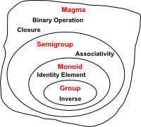

Monoid
======
Let ````T```` be a data type. A **monoid** is a triple 
````(T, f, z)```` such that ````f```` is an associative 
binary operation on T, and ````z ∈ T```` has the property 
that for all ````a, b, c, x ∈ T```` it holds that 

* ````f(x, z) = f(z, x) = x````
* ````f(a, f(b, c)) = f(f(a, b), c)```` 

Note that ````z```` is called an identity value


Simply, a monoid is defined as "an algebraic structure with a 
single associative binary operation and identity element."

A monoid must contain at least one element.

A monoid that is commutative is, known as a commutative monoid.  

Example of Monoids
==================
* Addition operation or a set of integers is a monoid and z is number 0.

* Multiplication operation or a set of integers is a monoid and z is number 1.


Example of Non-Monoids
======================  
* Average operation over a set of doubles data type is not a monoid since the means of means is not a mean.

* A division operation over a set of doubles data type is not a monoid since ````a / b```` is not the same as ````b / a````
  

Sources and References
======================

* [Monoid](https://en.wikipedia.org/wiki/Monoid)

* [Monoidify! Monoids as a Design Principle for Efficient MapReduce Algorithms by Jimmy Lin](https://arxiv.org/pdf/1304.7544v1.pdf)

* [Monoids Piyush Mishra](./monoids-by-Piyush-Mishra.pdf)


[](http://shop.oreilly.com/product/0636920033950.do)
